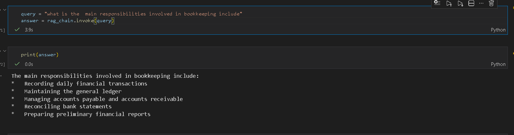
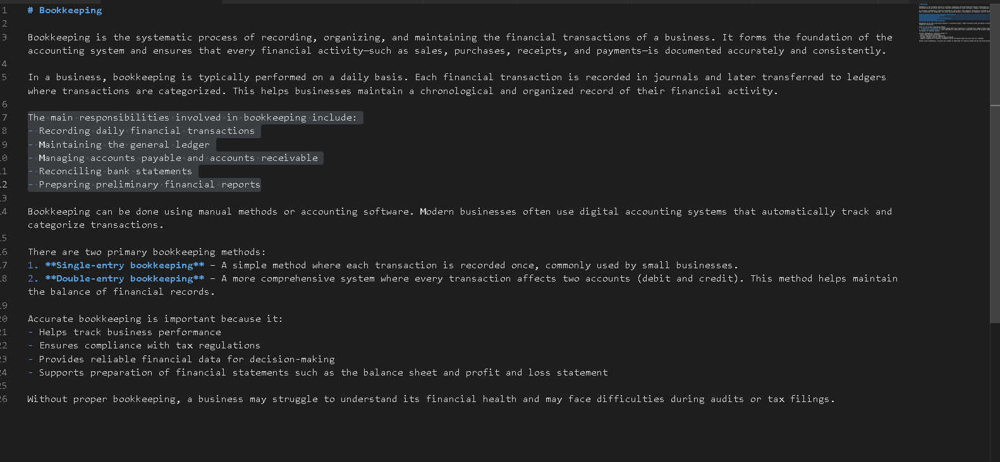
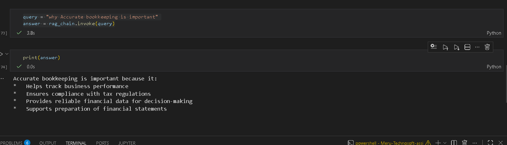
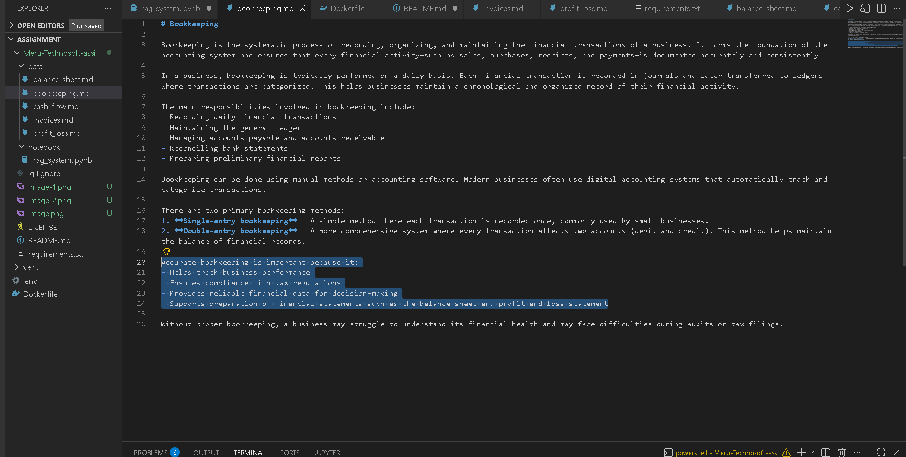

# Hellobooks AI Assistant (RAG Prototype)

Question 1

the model predicted correctly from referecne 

Question 2

the model predicted correctly from referecne 

This project is a small **Retrieval-Augmented Generation (RAG) system** built as part of an internship assignment.

The system answers **basic accounting questions** using a small knowledge base.

Example topics:
- Bookkeeping
- Invoices
- Profit & Loss
- Balance Sheet
- Cash Flow

---

# Project StructureMeru-Technosoft-assi
│
├── data
│ ├── balance_sheet.md
│ ├── bookkeeping.md
│ ├── cash_flow.md
│ ├── invoices.md
│ └── profit_loss.md
│
├── notebook
│ └── rag_system.ipynb
│
├── requirements.txt
├── Dockerfile
└── README.md

---

# How the System Works
Flow:
User Question
↓
Document Retrieval (FAISS)
↓
Relevant Context
↓
LLM generates answer

---

# Running the Project Locally

## 1. Clone the Repository
## 2. Install Dependencies 
--- pip install -r requirements.txt
---

## 3. Start Ollama
Make sure Ollama is installed.
Pull required models:
ollama pull nomic-embed-text
ollama pull phi3:mini
Start Ollama:

ollama serve

---

## 4. Run the Notebook

jupyter notebook

Open:

notebook/rag_system.ipynb

Run the cells to test the RAG system.

---

# Running with Docker

## Build the Docker Image

docker build -t hellobooks-rag .

## Run the Container

docker run -p 8888:8888 hellobooks-rag

Open in browser:

http://localhost:8888

---

# Example Question